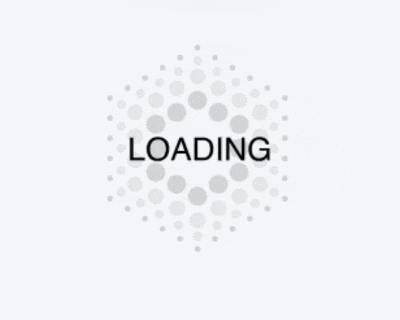
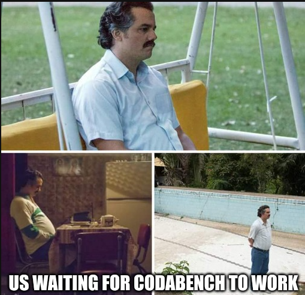

# 🧠 DeepL-1

Report of the first *Artificial Neural Network and Deep Learning [2024/25]* Homework, by DeepL team.

You can find the `pdf` file in the release section ↗️  

Instead, in the `notebooks` folder you can see the Jupyter Notebooks we used. Finally, you can download the starting dataset `training_set.npz` as well as our modified versions in this [Google shared folder](https://drive.google.com/drive/folders/1ooHaQ6mt1MRbEPV5rCKzh-goHEwEMqzy?usp=sharing)

## DeepL Team Members

- Matteo Bonfadini (me)
- Lorenzo Cossiga
- Michele Baggi
- Eleonora Lippolis

## Memes and Conclusion

In addition to the issues caused by the competition host, Codabench, some memes emerged as well. The frustration we experienced is shown here: 

 

You can find out more memes in the `meme` folder.

---

However, our motto is **Never give up**, and that’s exactly what we did. We embraced every tear we shed, right until the very last one. That’s how empires are built.

